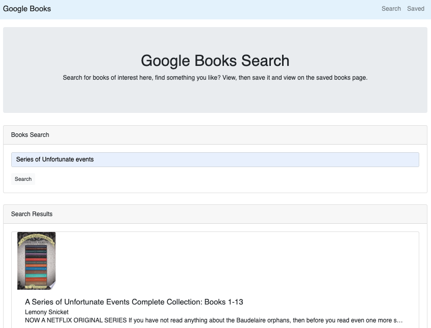

# Google Books Search

An app that uses the google books API to search by name, any searched books can then be saved to the database and reviewed later.

## Motivation

React-based Google Books Search app. This App utilizes React lifecycle methods to query and display books based on user searches. Node, Express and MongoDB allows users to save books for review or purchase later.

## Website

Hosted on [fly.io](https://google-books-wb.fly.dev/)

## Getting Started

1. Navigate to the landing page as shown above.
2. Click on the search tab first to search for any books in the Google Books API database.
3. Once searched, click to read more (will redirect to google books page). If you like what you see return to the page and "save" the books you like!
4. Click the "Saved" tab in the top right to go to your saved books, any you don't like can be deleted

## Prerequisites

No special hardware or software is required to use this web app. All you need is a modern browser.

## Screenshots

## Built With

- HTML
- CSS (including Foundation CSS framework)
- JavaScript
- create-react-app
- heroku
- express
- mongoose
- if-env
- material-ui
- react-router
- axios
- bootstrap
- react

## Author(s)

Wilson Birch (wilsonbirch)

## License

## Acknowlegments

Thanks to the Carleton University Coding bootcamp for the idea!
